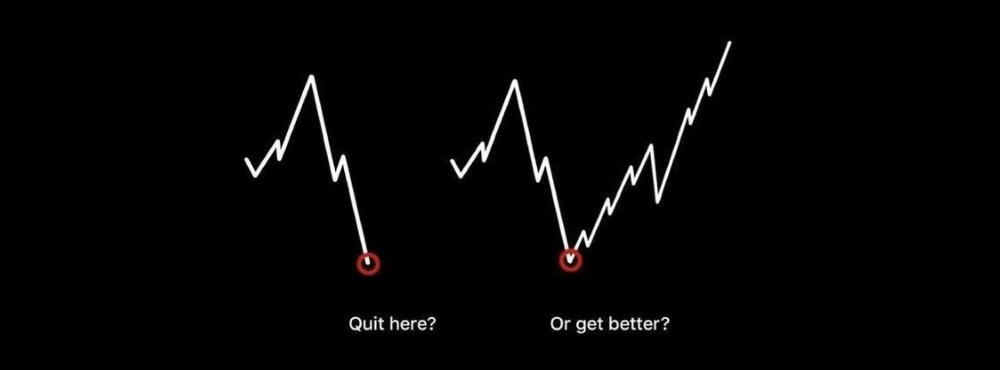
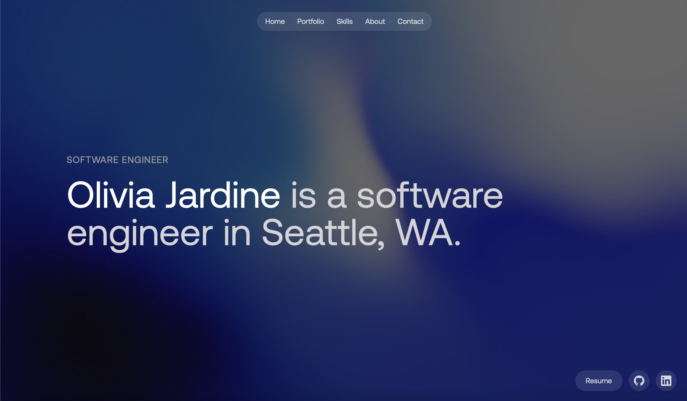

<h1 align="center">📈 Olivia Jardine</h1>

  <b>Sophomore - B.S. Discrete Math & Algorithms @ University of Washington</b> 
  Quant Finance Fanatic | Math & Programming Enthusiast | Systematic Thinker

  

> 💬 *“Forget crystal balls — I have NumPy and a backtester.”*

---

## My Portfolio - [oliviajardine.com](https://oliviajardine.com)

  

## Dev Toolkit

### 🛠️ Core Stack
- **Languages**: Python, C++, TypeScript, SQL
- **Frameworks**: FastAPI, Flask, React, Node
- **Tools**: Git, Docker, Azure, VS Code
- **Databases**: PostgreSQL, MySQL, SQLite

### 📈 Quant Focus
- **Backtesting**: Custom engines, risk modeling, slippage simulation
- **Alpha Research**: Factor testing, signal engineering, performance metrics
- **Math & Stats**: Linear Algebra, Probability, Optimization, Stochastic Processes
- **ML/DS**: Feature pipelines, labeling, time series modeling

  

---

## Currently

- 📍 Seattle, WA  
- Learning: Portfolio theory, numerical methods, RL for trading  
- Building: C++ + Python hybrid alpha engine for live-sim trading

---

## ☕ Connect with Me

  
  
  
  

